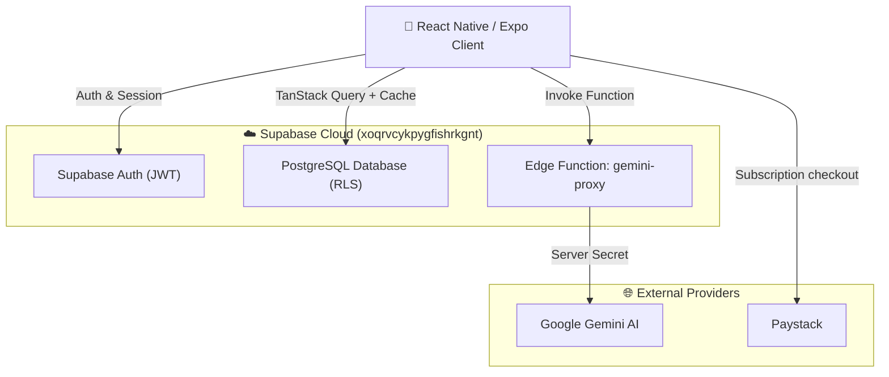

# Bambini Tracker — Developer Handover & Update Brief

Welcome to the **Bambini Tracker** project! This document outlines the major updates, architectural changes, security fixes, and remaining roadmap tasks completed over the last 48 hours to help you get up to speed immediately.

---

## 1. Quick Setup & Environment

### Clone & Dependencies
```bash
git pull origin main
npm install
```

### Environment Configuration
Sensitive keys have been separated into client and server files:
1. **Client environment (`.env`)**:
   Copy `.env.example` to `.env`. This contains `EXPO_PUBLIC_*` variables required by Expo:
   * `EXPO_PUBLIC_SUPABASE_URL`
   * `EXPO_PUBLIC_SUPABASE_ANON_KEY`
   * `EXPO_PUBLIC_PAYSTACK_PUBLIC_KEY`
2. **Server environment (`.env.server`)**:
   Used strictly for backend operations and deployment. Contains `SUPABASE_SERVICE_ROLE_KEY` and `GEMINI_API_KEY`. (Kept out of Git).

### Supabase CLI Link
The project is hosted on Supabase Cloud:
* **Project Reference:** `xoqrvcykpygfishrkgnt`
* **Link via CLI:**
  ```bash
  npx supabase link --project-ref xoqrvcykpygfishrkgnt
  ```

### Running Locally
```bash
npm run ios     # or npx expo run:ios
npm run android # or npx expo run:android
```

---

## 2. What Was Changed & Updated (Changelog)

### A. Security & Key Protection
* **Server-Side AI Proxy:** The Google Gemini API key has been removed from client-side code. We created and deployed a Supabase Edge Function:
  * Location: `supabase/functions/gemini-proxy/index.ts`
  * Client caller: `lib/gemini.ts` invokes `supabase.functions.invoke('gemini-proxy', ...)`
  * Project secret `GEMINI_API_KEY` is securely stored in Supabase Secrets vault.
* **Environment Sanitization:** Removed sensitive keys from client `.env` and added `.env.server` + `supabase/.temp/` to `.gitignore`.
* **Cryptographic Randomness:** Replaced `Math.random()` with `crypto.getRandomValues()` for secure invite code generation (`hooks/useChildren.ts`).
* **Input Validation:** Added email formatting regex, password length constraints (8+ chars), and name validation to login and signup screens.

### B. Critical Bug Fixes
* **Duplicate QueryClient:** Fixed React Query double-initialization in `app/_layout.tsx` (now strictly unified in `lib/query.ts`).
* **Auth Subscription Memory Leak:** Added proper unsubscribe cleanup on `supabase.auth.onAuthStateChange` in `app/_layout.tsx`.
* **ISO Date Formatting Typo:** Fixed malformed ISO timestamp string (`T00:00:000Z` → `T00:00:00.000Z`) that was corrupting daily activity queries.
* **Forgot Password Flow:** Implemented password reset email trigger via `supabase.auth.resetPasswordForEmail()` in `app/(auth)/login.tsx`.
* **Home Screen Infinite Sync Loop:** Fixed `useEffect` dependency cycle that was repeatedly triggering daily activity synchronizations.

### C. Architecture & Code Quality
* **Modularized Data Hooks:** Split the monolithic `hooks/useData.ts` (1,000+ lines) into 7 single-responsibility domain modules:
  * `hooks/useProfile.ts` — User profile retrieval and mutation
  * `hooks/useChildren.ts` — Child management, deletions, and invite codes
  * `hooks/useActivities.ts` — Library, daily sync, completion, tips
  * `hooks/useObservations.ts` — Observation history and logging
  * `hooks/useMilestones.ts` — Milestone catalog, progress toggling, synthesis
  * `hooks/useGrowth.ts` — Measurement CRUD
  * `hooks/useHealth.ts` — Vaccinations and health logs
  * `hooks/useData.ts` — Clean barrel re-export file for 100% backwards compatibility with existing UI screens.
* **Dev Log Cleanup:** Guarded high-frequency console logs behind `__DEV__`.

### D. Multi-User Cache Isolation & Auth Leak Fix
* **The Problem:** Because TanStack Query persisted queries to `AsyncStorage` (`PersistQueryClientProvider`) with a 24-hour retention period, switching between accounts on the same device was serving the previous account's cached profile name and children.
* **The Solution:**
  * Implemented `clearAppCache()` in `lib/query.ts` which cancels in-flight queries and removes `REACT_QUERY_OFFLINE_CACHE` from `AsyncStorage`.
  * Connected `clearAppCache()` to `onAuthStateChange` (`SIGNED_IN`, `SIGNED_OUT`, `USER_UPDATED`) and explicit login/signup/logout actions.
  * Configured `staleTime: 0` on `useProfile` and `useChildren` so account data is always verified against the active Supabase JWT.

---

## 3. Architecture Overview



---

## 4. Next Steps & Developer Action Plan

Your primary assignment begins with **polishing and verifying the Authentication system**, followed by a **rigorous end-to-end audit of every tab, link, modal, and feature** in the application.

---

### Phase 1: Authentication & Onboarding Polish (Immediate Starting Point)

Start in `app/(auth)/` (`login.tsx`, `signup.tsx`, `welcome.tsx`):

1. **Sign Up & Registration Flow:**
   * Verify registration for both **Parent** and **Teacher** roles.
   * Test form field validation (name, email format regex, minimum 8-character password).
   * Ensure friendly inline error feedback and keyboard avoidance (`KeyboardAvoidingView` / dismiss on tap outside).
   * Verify email verification flow and onboarding redirection.

2. **Login & Session Management:**
   * Verify `supabase.auth.signInWithPassword()` error handling (e.g. wrong credentials, unverified email, network drop).
   * Test **Forgot Password** email delivery and reset password link redirect.
   * Verify persistent sessions across app kills and simulator/device relaunches.
   * Confirm that `clearAppCache()` cleanly purges TanStack Query and `AsyncStorage` caches so no user data ever bleeds across account switches.

3. **Sign Out Flow:**
   * Test sign out from `app/(tabs)/profile.tsx` to verify clean cache purge and redirection to `/(auth)/welcome`.

---

### Phase 2: Systematic Feature, Tab & Link Testing Matrix

Once Auth is 100% solid, walk through every screen and test every interactive element:

| Screen / Feature | Key Tests & Verification Points |
| :--- | :--- |
| **Home (`app/(tabs)/index.tsx`)** | • Multi-child switcher (avatar selection & active border)<br>• Greeting & streak counter accuracy<br>• Daily activity generation & sync (5 activities/day)<br>• Activity checkbox completion & progress ring calculation<br>• Newborn tips & developmental advice cards |
| **Milestones (`app/(tabs)/milestones.tsx`)** | • Domain filters (Cognitive, Language, Physical, Social, Sensory)<br>• Toggling milestone achieved status and checking database persistence<br>• AI Milestone Synthesis generation (verifies `gemini-proxy` Edge Function) |
| **Growth Tracker (`app/(tabs)/growth.tsx`)** | • Adding, editing, and deleting measurements (weight, height, head circumference)<br>• Chart rendering and WHO growth percentile curves<br>• Unit toggling (Metric vs. Imperial) |
| **Activities Library (`app/(tabs)/activities.tsx`)** | • Age-appropriate activity browsing and search<br>• Activity detail modal and duration timers<br>• Photo capture / upload via `expo-image-picker`<br>• Observation logging and feedback submission |
| **Profile & Settings (`app/(tabs)/profile.tsx`)** | • Profile details editing (name, phone, avatar)<br>• Child management: Add Child, Edit Child details, Delete Child<br>• Teacher / Partner invite code generation (`crypto.getRandomValues`)<br>• Sign Out confirmation alert and cache flush |
| **Navigation & Modals** | • Verify all bottom navigation tabs switch smoothly without re-render flickers<br>• Verify all back buttons (`router.back()`), close buttons, and sheet gestures work properly<br>• Verify deep links and modal presentations (`presentation: 'modal'`) |

---

### Phase 3: Backend, Security & Deployment Checklist

After client-side features are verified:

1. **Paystack Webhook Verification:**
   * Move subscription activation from client-side callbacks to a secure Supabase Edge Function webhook listener.
2. **Database Row Level Security (RLS) Audit:**
   * Update RLS policies on `growth_measurements`, `child_milestones`, and `health_logs` to enforce parent ownership (`check_child_access`) rather than permissive `USING (true)`.
3. **App Permissions (`app.json`):**
   * Ensure `expo-image-picker` has clear permission strings (`photosPermission`, `cameraPermission`) to prevent Apple TestFlight ingestion rejection (`ITMS-90683`).
4. **EAS Build & Release Setup (`eas.json`):**
   * Configure `preview` profile with `"buildType": "apk"` for direct Android test downloads.
   * Configure `production` profile with `"autoIncrement": true` for iOS TestFlight submission.
