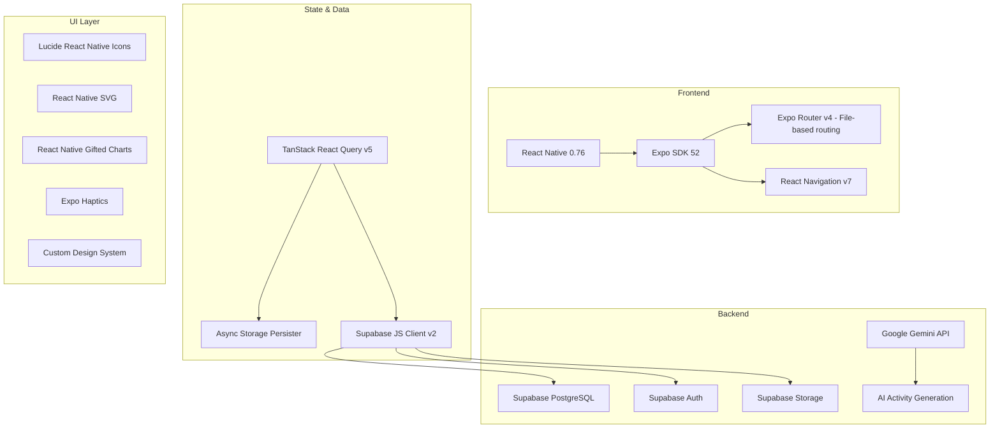
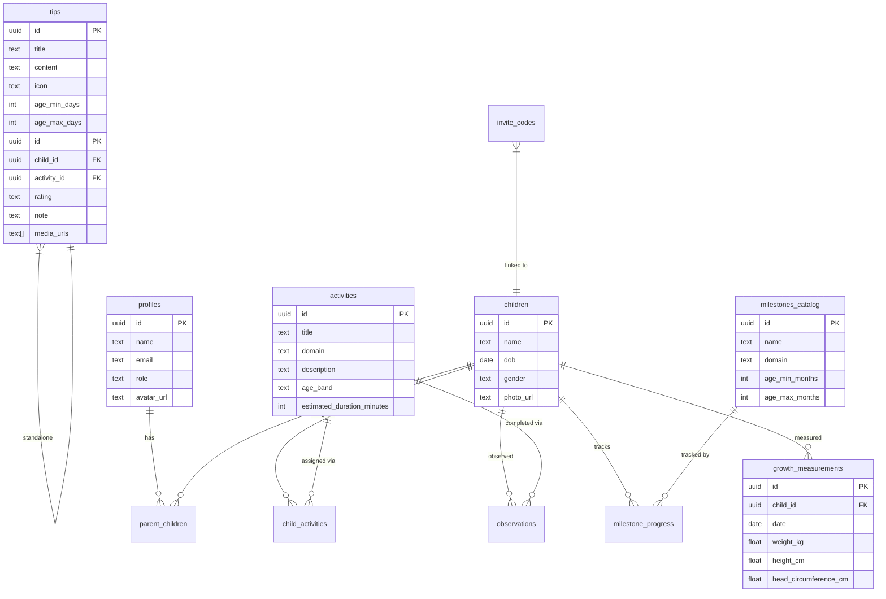

# Bambini Tracker — Application Summary

## What It Is

**Bambini Tracker** is a cross-platform mobile app (iOS & Android) that helps parents and teachers collaboratively track early childhood development from birth through age 6. It combines **AI-generated daily activities**, **developmental milestone tracking**, **growth measurements**, and **expert parenting tips** into a single, beautifully designed experience.

---

## Core Features

### 🏠 Home Dashboard & Activities
- **Dynamic greeting** based on time of day
- **Multi-child support** with horizontal avatar selector
- **Developmental stage card** showing the child's current phase (Newborn → Infant → Toddler → Preschooler) with a circular progress ring for daily activity completion
- **AI-curated daily activities** (3–5 per day) generated by Google Gemini, tailored to the child's exact age in days
- **Newborn mode** — special tips section for babies < 25 days old with age-appropriate advice from a `tips` database table
- **Activity Feedback System** — "Mark as Complete" opens a rich modal allowing parents to record a rating (loved it/just okay/too hard), add text notes, and upload photos/videos to an `observations` storage bucket.
- **Adaptive AI** — The AI generator consumes the 5 most recent feedback observations to tailor the next day's activities (e.g., suggesting simpler tasks if recent feedback was "too hard").

### 🧭 Discover (Activities Library)
- **"Recommended for [Child]" Carousel**: A horizontal swipeable section featuring large "Hero" cards that dynamically filters down the catalog to activities matching the active child's exact age in months. Excludes any activities they are already assigned today.
- **Browse Collection**: The full catalog sitting below the recommendations.
- **Domain filter pills** (Cognitive, Gross Motor, Fine Motor, Language, Social, Creative, Sensory)
- **Text search** across titles and descriptions
- Visual upgrades including softer shadows, glass-like vibrant backgrounds for hero cards, and haptic feedback on interactions.

### 📊 Growth Screen
Two sub-tabs:

**Overview Tab:**
- **SVG radar chart** visualizing milestone progress across all 7 developmental domains
- **Growth measurements** (weight, height, head circumference) with line chart visualizations
- **Add measurement** modal with date picker
- **Smart Observation Prompts**: Dynamically detects the child's most practiced domain and cross-references their age/progress to suggest explicitly which specific clinical milestone parents should look out for next.

**Timeline Tab (New):**
- **Activity Timeline**: Displays a chronological narrative feed of all activities assigned and completed, with parent feedback entries.

**Milestones Tab:**
- **Horizontal age-stage chips** (0–3m through 5–6y) with mini SVG progress rings
- **Collapsible domain accordion sections** with emoji headers, progress counts, and chevron toggles
- **Animated milestone cards** with:
  - 4px domain-colored left accent stripe
  - 3-state toggle: Not Yet → Sometimes → Yes! ✓
  - Achievement pulse animation + sparkle ✨ overlay on "Yes!"
  - Amber pulsing glow + "👋 Can your child do this?" nudge on unanswered cards
- **Mascot speech-bubble tip callouts** (🧸🦉🐣🐰) with contextual guidance

### 👤 Profile
- Parent avatar with edit capability (camera/gallery upload to Supabase Storage)
- Role badge (Parent/Teacher)
- Children list with age display and edit/delete actions
- **Invite Teacher** flow — generates a unique 6-character invite code linked to a child
- Navigation to About, Notifications settings
- Sign out

### 🔐 Authentication Flow
- **Welcome screen** → **Onboarding** (3-slide carousel with app mockups) → **Sign Up / Login**
- Email + password auth via Supabase Auth
- Role selection (Parent or Teacher) during signup
- Automatic profile creation on first sign-in

---

## Key Benefits

| Benefit | Description |
|---------|-------------|
| **AI-Powered & Adaptive** | Google Gemini generates personalized activities and actively learns from parent feedback (ratings, notes) to suggest better activities tomorrow |
| **Rich Memories** | Parents can upload photos and videos when completing activities to build a visual history of their child's development |
| **7 Developmental Domains** | Tracks Cognitive, Gross Motor, Fine Motor, Language, Social, Creative, and Sensory |
| **Parent-Teacher Collaboration** | Invite codes let teachers view and contribute to a child's development |
| **Zero-Config Experience** | Activities are auto-generated — parents just open the app and start |
| **Evidence-Based Milestones** | Milestone catalog based on developmental standards from birth–6 years |
| **Growth Tracking** | Weight, height, and head circumference logging with trend charts |
| **Visual Insights** | Radar charts, progress rings, and animated cards make data engaging |
| **Offline-Friendly** | React Query caching keeps the app responsive even with spotty connectivity |

---

## Tech Stack



| Layer | Technology |
|-------|-----------|
| **Framework** | React Native 0.76 + Expo SDK 52 |
| **Routing** | Expo Router v4 (file-based) |
| **Language** | TypeScript 5.9 |
| **State Management** | TanStack React Query v5 |
| **Backend / DB** | Supabase (PostgreSQL + Auth + Storage) |
| **AI Engine** | Google Gemini (`@google/genai`) |
| **UI Icons** | Lucide React Native |
| **Charts** | React Native SVG (custom radar) + Gifted Charts |
| **Typography** | Google Fonts (Inter + Nunito) |
| **Haptics** | Expo Haptics |

---

## Application Architecture

### Project Structure

```
bambinitracker/
├── app/                          # Expo Router file-based routes
│   ├── (auth)/                   # Auth flow (welcome, onboarding, login, signup)
│   ├── (tabs)/                   # Main tab screens
│   │   ├── index.tsx             # Home dashboard
│   │   ├── activities.tsx        # Discover / activities library
│   │   ├── growth.tsx            # Growth & milestones
│   │   ├── messages.tsx          # Messages (placeholder)
│   │   ├── profile.tsx           # User profile
│   │   └── add-child.tsx         # Add child form
│   ├── activity/[id].tsx         # Activity detail (dynamic route)
│   ├── edit-child.tsx            # Edit child details
│   ├── edit-profile.tsx          # Edit parent profile
│   ├── invite-teacher.tsx        # Teacher invite code flow
│   └── about.tsx                 # About screen
├── components/
│   ├── design-system/            # Reusable UI components
│   │   ├── BambiniText.tsx       # Typography component
│   │   ├── BambiniButton.tsx     # Button component
│   │   ├── BambiniCard.tsx       # Card component
│   │   ├── BambiniInput.tsx      # Text input component
│   │   ├── BambiniSkeleton.tsx   # Loading skeleton
│   │   ├── ChildAvatar.tsx       # Child photo avatar
│   │   └── ParentAvatar.tsx      # Parent photo avatar
│   └── useColorScheme.ts        # Dark/light mode hook
├── hooks/
│   └── useData.ts                # All data hooks (queries + mutations)
├── lib/
│   ├── supabase.ts               # Supabase client initialization
│   └── gemini.ts                 # Gemini AI activity generation
├── utils/
│   ├── ui.ts                     # Domain config, emojis, colors, greeting
│   └── childAge.ts               # Shared age calculation utilities
├── constants/
│   └── Colors.ts                 # Theme color tokens
├── supabase/
│   ├── milestones_v2.sql         # Milestones catalog schema + seed data
│   └── tips.sql                  # Tips table + seed data
└── assets/
    ├── fonts/                    # Nunito + Inter font families
    └── images/                   # App icons, splash, onboarding slides
```

### Database Schema



### Data Flow

```
User Action → React Component → useData Hook → Supabase Client → PostgreSQL
                                     ↓
                              React Query Cache
                                     ↓
                              UI Re-render
```

For AI-generated activities:
```
Child's Age (days) + Recent Feedback (Ratings & Notes) → Gemini API → Generated Activities → Supabase Insert → child_activities table → UI
```

---

## Current Status

- **Version:** 1.0.0
- **Platforms:** iOS, Android (via Expo)
- **Auth:** Email/password (Supabase Auth)
- **AI:** Google Gemini for activity generation
- **Milestones:** 100+ milestones across 7 domains, 9 age stages (0–6 years)
